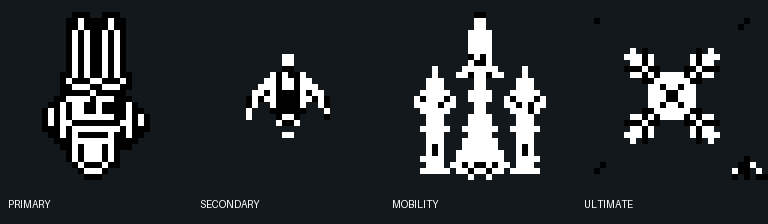

# Ability slot icons

These reward-card slot icon prototypes were generated at their native 32×32 size with PixelLab and normalized to the SpaceDaze black-and-white palette. The live card UI now uses text labels for the four slots, so these concepts remain documented here rather than loading as game assets.

| Slot | PixelLab job | Visual brief |
| --- | --- | --- |
| Primary | `f887b9e9-51b7-476f-954a-91979b905f6e` | Upright north-facing twin-barrel energy cannon with a compact receiver |
| Secondary | `104c6bed-56e5-45b9-afad-0795fe5c35bb` | North-facing missile with a clear nose, fins, and body seam |
| Mobility | `f8cbe38f-0e0b-4a74-b733-0979f0745402` | Three strong upward thrust columns from a compact engine bank |
| Ultimate | `7ab3ba42-459e-491e-a097-3726d09bc772` | Contained phase core with four cardinal energy rays |

Primary was palette-reduced by PixelLab job `a9eb17ae-031a-464b-b857-0da3c85c6989`.

