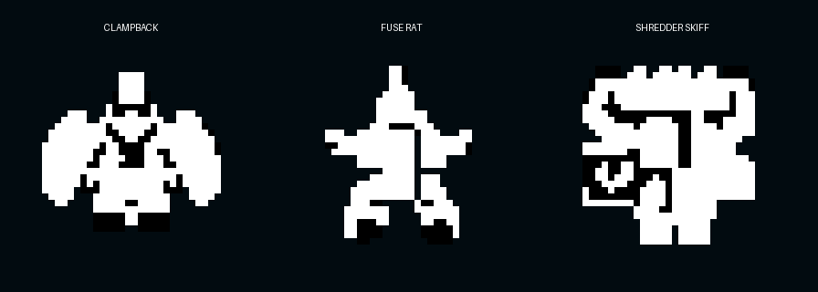
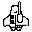
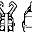
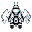
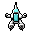
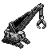
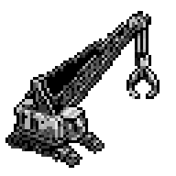
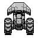

# Wake Enemy PixelLab Concepts

These are the approved source concepts for the playable Wake Scrap District
roster. Runtime-ready body and component layers live in
`public/sprites/enemies/wake`.

All concepts were generated as north-facing top-down objects using the
existing SpaceDaze enemy sprites as style references.

| Enemy | Native size | PixelLab object | Selected candidate | Destructible-layer plan |
| --- | ---: | --- | ---: | --- |
| Scrap Nipper | 32x32 | `1e4e0cd6-85ab-473c-90b9-a768bead6f5b` | 10 | Separate left and right cutter jaws |
| Rivet Gunner | 32x32 | `f500313c-59bb-40b6-8602-b6772fa75887` | 7 | Separate forward rivet driver |
| Towhook Rig | 32x32 | `d9379504-9812-4436-b706-18aef87eee03` | 4 | Separate left and right hook arms |
| Patch Tender | 32x32 | `fb3aff08-342f-46ed-b06b-f8e3b74b427b` | 3 | Separate forward welding arm |
| Scrap Raiser | 32x32 | `7be1a344-fd90-4a89-aa6f-63c3522107b6` | 3 | Separate left and right collector arms |
| Clampback | 32x32 | `bbbd22f2-0f70-4aee-ba15-74371305bdfd` | Pixen | Separate left and right armor clamps |
| Fuse Rat | 32x32 | `f35dea57-7a39-4dbd-bfff-f345744dfefd` | Pixen edit | Separate overcharger battery |
| Shredder Skiff | 32x32 | `fe96940e-4f34-4f6f-b6f4-6a4facb44799` | 5 | Separate forward grinder and side hopper |
| Boiler Hulk | 64x64 | `92967acd-a359-4f07-bf71-95bd34e4f6f7` | 1 | Separate scoop and vent stack |
| Magnet Maw | 64x64 | `d001e559-a75c-4b82-b713-49c8d6b35b4e` | Pixen edit + Creator crane | Fixed platform, PixelLab-animated crane, and two magnetic drums |
| Railbreaker Rig | 64x64 | `6fb385a1-e954-49d8-a513-942b03a2756f` | Pixen edit | Separate ram and left/right thrusters |

## Concepts

### Scrap Nipper

The broad open jaw and two uneven lower jets remain readable at 32x32. Each
cutter jaw is a separate component. Breaking one weakens the lunge; breaking
both removes the lunge and leaves the exposed core trying to escape.

### Rivet Gunner

The forward barrel sits away from the main hull and can become a separate
component. The body remains recognizable after the weapon is removed.

### Towhook Rig

The paired hook arms dominate the silhouette and form two clean component
regions. The narrow engine body remains readable after either or both are lost.

### Patch Tender

The round work platform and surrounding tool arms read as civilian machinery.
The upper welding arm will become the functional destructible component.

### Scrap Raiser

The open central hopper, pointed sensor nose, and uneven collection arms make
its salvage role readable. Both collection arms are separate components.
Breaking one slows reconstruction, while breaking both spills stored scrap and
prevents further reconstruction.

### Clampback

The paired armor clamps dominate the broad silhouette while leaving a compact
core and scrap shotgun readable between them. Each clamp becomes an independent
destructible part. Breaking one opens that firing side; breaking both removes
the defensive stance and pushes the exposed core into its faster attack state.

### Fuse Rat

The narrow pointed sensor, small tool claws, and oversized central battery make
the saboteur readable without giving it a manufactured Federation profile. The
overcharger battery becomes its destructible part. Breaking it interrupts an
active sabotage and prevents the Fuse Rat from priming another explosive.

### Shredder Skiff

The horizontal forward grinder, offset scrap hopper, and twin lower engines
create a strong north-facing industrial silhouette. The grinder and hopper
become separate parts. A broken grinder removes its close-range attack; a
loaded hopper detonates outward when destroyed.

### Boiler Hulk

The central boiler, offset stack, and large side scoop make the miniboss
asymmetric without losing its forward direction. The scoop and stack will be
separated while the boiler remains the body target.

### Magnet Maw

The base is fixed to a broad salvage platform, making the boss read as room
machinery rather than a hovering ship. The complete original platform remains
intact. A separate crane and nine-frame sweep were generated with PixelLab
Creator (`1789097307947` and `1789097382395`) and mounted over its center
pedestal. Its two exposed magnetic drums power a pull-and-release field
independently. Destroying either drum weakens the field; destroying the crane
or both drums disables it.

### Railbreaker Rig

The oversized north-facing ram defines the charge direction, while the two
rear track-thrusters remain visually separate. Breaking the ram cuts impact
damage and increases crash stun. Breaking thrusters progressively lowers the
charge speed and makes the rig easier to evade.

## Runtime implementation

The regular enemies use the strict Ink palette. The three minibosses may use
eight grayscale values for added mechanical detail, with binary alpha. Every
destructible component is stored on an aligned native-size canvas, so it can be
hidden and detached without shifting the remaining silhouette. Motion and
attack anticipation are currently driven in code; sprite animation and unique
detached debris frames remain optional later polish.
